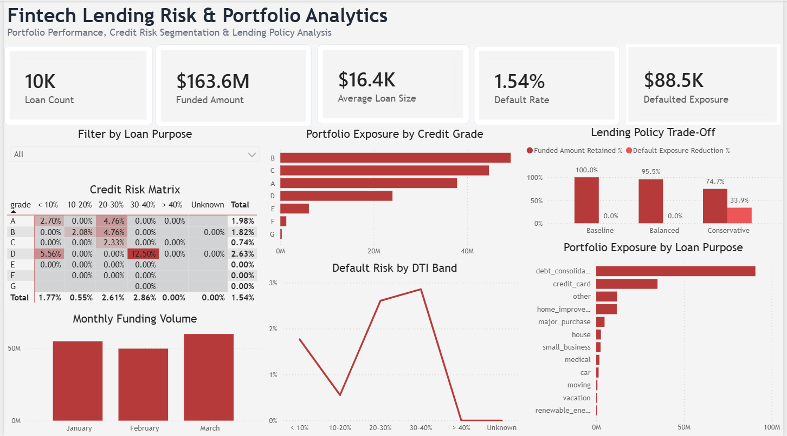

# Fintech Lending Risk & Portfolio Analytics

An end-to-end data analytics project that analyzes lending portfolio performance, identifies credit risk patterns, and evaluates underwriting policy scenarios using **Python, SQL, statistical analysis, and Power BI**.

The project transforms raw lending data into decision-oriented insights through a complete analytics workflow:

**Raw Data → Data Cleaning → Exploratory Analysis → Statistical Testing → SQL Analytics → Policy Simulation → Power BI Dashboard → Executive Recommendations**

## Project Overview

Digital lenders must balance two competing objectives: maintaining lending volume while controlling credit risk.

This project analyzes a historical loan portfolio covering **January through March 2018** to answer three key business questions:

* Where is default risk concentrated across borrower and loan segments?
* Which borrower characteristics are associated with higher observed default rates?
* How would stricter underwriting policies affect funded volume and default exposure?

The analysis combines Python-based data preparation and statistical testing, SQL-based portfolio analysis, policy scenario simulation, and an interactive Power BI dashboard.

## Dashboard



The Power BI dashboard provides a one-page view of portfolio performance, credit risk segmentation, and lending policy trade-offs.

### Dashboard Features

* Portfolio KPIs for loan volume, funded amount, average loan size, default rate, and defaulted principal exposure
* Interactive filtering by loan purpose
* Credit risk matrix across Credit Grade and DTI bands
* Portfolio exposure analysis by Credit Grade
* Default risk analysis across DTI segments
* Monthly funding volume analysis
* Portfolio concentration analysis by loan purpose
* Lending policy scenario comparison

## Key Portfolio Metrics

| Metric                       |   Value |
| ---------------------------- | ------: |
| Total Loans                  |     10K |
| Total Funded Amount          | $163.6M |
| Average Loan Size            |  $16.4K |
| Observed Default Rate        |   1.54% |
| Defaulted Principal Exposure |  $88.5K |

## Methodology

### 1. Data Cleaning and Validation

The raw lending dataset was processed using Python to:

* inspect schema and data quality
* handle missing values and inconsistent fields
* create analytical features
* distinguish active loans from loans with observable outcomes
* prevent in-flight loans from artificially lowering observed default rates

An `outcome_eligible` flag was introduced so portfolio volume metrics could include the full portfolio while default calculations used only loans with observable outcomes.

### 2. Exploratory Data Analysis

Python-based exploratory analysis examined portfolio characteristics and potential risk drivers.

The analysis focused on:

* credit grade
* debt-to-income ratio (DTI)
* loan purpose
* funded amount
* loan status
* default behavior

The analysis identified concentrated risk patterns across specific Credit Grade and DTI segments.

### 3. Statistical Analysis

Statistical tests were used to evaluate whether observed portfolio patterns were supported by quantitative evidence.

The analysis included:

* Chi-square tests
* independent-sample t-tests
* Cramér's V effect size
* Cohen's d effect size
* Wald confidence intervals

This separated statistically measurable relationships from purely descriptive observations.

### 4. SQL Portfolio Analytics

SQL queries were developed to reproduce and validate the core analytical findings.

The SQL workflow includes:

* data quality checks
* portfolio KPI calculations
* credit risk segmentation
* default analysis
* lending policy scenario simulation

### 5. Lending Policy Simulation

Three underwriting strategies were evaluated against historical portfolio performance.

| Policy       | Lending Rules                    | Funded Amount Retained | Default Exposure Reduction |
| ------------ | -------------------------------- | ---------------------: | -------------------------: |
| Baseline     | Existing portfolio               |                 100.0% |                       0.0% |
| Balanced     | Exclude Grade G and DTI > 35%    |                  95.5% |                       0.0% |
| Conservative | Exclude Grades E–G and DTI > 25% |                  74.7% |                      33.9% |

The simulation highlights the trade-off between maintaining lending volume and reducing observed default exposure.

## Key Findings

* The analyzed portfolio contains approximately **10,000 loans representing $163.6M in funded amount**.
* The portfolio's observed default rate is **1.54%** after accounting for outcome eligibility.
* Lending exposure is concentrated primarily in **Credit Grades B, C, and A**.
* Observed default risk varies substantially across Credit Grade and DTI segments.
* The highest observed risk concentration appears in specific high-risk Grade-D/DTI combinations.
* The **Balanced policy retains 95.5% of historical funded amount but produces no reduction in observed default exposure** in this dataset.
* The **Conservative policy reduces observed default exposure by 33.9% but sacrifices approximately 25.3% of historical funded amount**.

## Business Recommendation

The policy simulation does **not** support automatically adopting the Balanced strategy as the optimal risk-reduction policy.

Although the Balanced policy preserves **95.5% of historical funded amount**, it produces **no observed reduction in default exposure** within the analyzed dataset.

The Conservative policy demonstrates measurable risk reduction, lowering observed default exposure by **33.9%**, but retains only **74.7% of funded amount**.

Therefore, the analysis suggests that underwriting policy decisions should explicitly evaluate the trade-off between portfolio growth and risk reduction. Rather than immediately implementing either simulated strategy, additional policy thresholds between the Balanced and Conservative scenarios should be tested to identify a more efficient risk-volume trade-off.

## Project Structure

```text
fintech-lending-risk-analytics/
│
├── data/
│   ├── raw/
│   └── processed/
│
├── database/
│   ├── lending_analytics.db
│   └── schema.sql
│
├── notebooks/
│   ├── 01_data_cleaning.ipynb
│   ├── 02_exploratory_analysis.ipynb
│   ├── 03_statistical_tests.ipynb
│   └── 04_policy_scenarios.ipynb
│
├── sql/
│   ├── 01_data_quality.sql
│   ├── 02_portfolio_kpis.sql
│   ├── 03_risk_segmentation.sql
│   └── 04_policy_scenarios.sql
│
├── dashboard/
│   └── dashboard.png
│
├── reports/
│   ├── dataset_audit.md
│   └── executive_summary.md
│
├── scripts/
│   └── audit.py
│
└── README.md
```

## Tools and Technologies

* **Python** — Pandas, NumPy, Matplotlib, statistical analysis
* **SQL / SQLite** — data validation, portfolio analytics, risk segmentation, and scenario analysis
* **Power BI** — interactive dashboard development and data visualization
* **Jupyter Notebook** — data preparation, EDA, and statistical analysis

## Skills Demonstrated

* Data Cleaning & Validation
* Exploratory Data Analysis
* SQL Analytics
* Statistical Hypothesis Testing
* Credit Risk Segmentation
* KPI Development & DAX
* Scenario Analysis
* Power BI Dashboard Development
* Business Insight Generation
