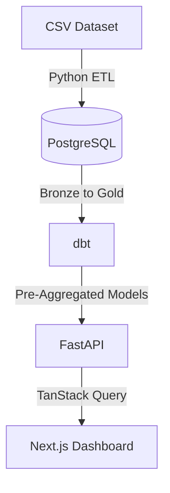
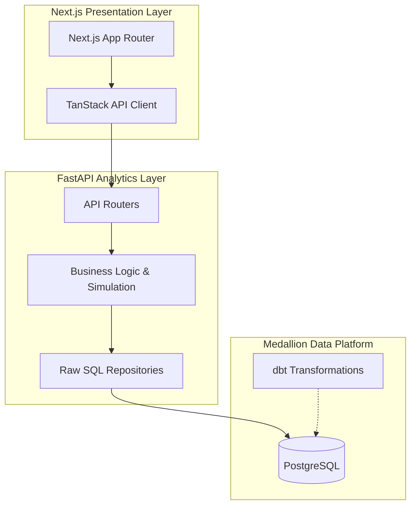

# CreditLens – Enterprise Credit Risk Intelligence Platform

> **CreditLens is a production-style decision intelligence platform for credit risk analysis. It combines a Medallion data warehouse, dbt transformations, FastAPI analytics services, and a modern Next.js dashboard to help analysts and executives evaluate lending policies through interactive simulations and business-focused insights.**

---

## 📖 Overview

CreditLens is built to provide actionable intelligence over loan portfolios. Instead of a traditional CRUD application, this platform is modeled after enterprise analytics solutions (like Bloomberg, Stripe, and Datadog), offering deep interactivity and scenario modeling capabilities.

### 🌟 Key Features
- **Medallion Data Warehouse**: Data flows through Bronze, Silver, and Gold layers ensuring data quality and analytical readiness.
- **Data Quality & Testing**: Automated dbt testing on all constraints (unique, not_null, accepted_values).
- **Enterprise Analytics API**: A high-performance FastAPI backend delivering pre-computed metrics and dynamic policy simulations.
- **Policy Studio**: An interactive environment to simulate credit policies against historical data, generating projected approval rates, expected loss, and automated recommendations.
- **Executive Dashboard**: A premium, dark-mode Next.js dashboard designed for rapid executive decision-making.

---

## 🏗️ Architecture

The platform demonstrates end-to-end data lifecycle management, separating data extraction, transformation, analytics, and presentation into logical, scalable tiers.

### High-Level Data Flow



### System Architecture



### Why this architecture?
- **PostgreSQL instead of SQLite**: SQLite is great for prototypes, but analytical queries, window functions, and concurrent reads require a robust database like PostgreSQL, mirroring enterprise data warehouses.
- **dbt instead of handwritten SQL**: Using dbt enables version-controlled, testable, and documented data models. It allows us to build a true Medallion architecture (Bronze -> Silver -> Gold).
- **Medallion Architecture**: Structuring data into raw, cleaned, and aggregated layers ensures that our frontend and APIs are querying highly optimized views rather than running expensive joins on the fly.
- **psycopg over an ORM**: Our backend is strictly read-only and analytical. By bypassing heavy ORMs like SQLAlchemy and using `psycopg` for raw parameterized queries, we achieve maximum throughput.
- **FastAPI**: It provides automatic OpenAPI documentation, high performance, and native Pydantic validation.
- **Next.js & App Router**: Next.js provides the best-in-class foundation for React applications. Combined with Tailwind CSS and Shadcn UI, it allows us to build a premium, fast, and highly interactive user experience.

---

## 🛠️ Tech Stack

- **Data Engineering**: Python, `psycopg2`, PostgreSQL
- **Data Warehousing**: dbt (Data Build Tool)
- **Backend API**: Python 3, FastAPI, `psycopg`, Pydantic
- **Frontend**: Next.js 15 (App Router), Tailwind CSS v4, shadcn/ui, Recharts, TanStack Query
- **Infrastructure**: Docker, Docker Compose

---

## 📂 Folder Structure

```text
fintech-lending-risk-analytics/
├── backend/          # FastAPI application (Services, Repositories, Schemas)
├── dbt/              # Data Build Tool models (Bronze, Silver, Gold schemas)
├── docs/             # Comprehensive enterprise architecture documentation
├── etl/              # Python ingestion scripts
├── frontend/         # Next.js App Router dashboard
├── docker-compose.yml# Container orchestration
└── README.md
```

---

## 🔌 API Examples

The backend is built around clean, business-oriented REST endpoints.

**`GET /api/v1/portfolio/summary`**
```json
{
  "success": true,
  "data": {
    "total_funded_amount": 163600000.0,
    "avg_default_rate": 0.0154
  },
  "metadata": {
    "generated_at": "2026-07-16T14:09:23.000Z",
    "source": "gold.portfolio_summary"
  }
}
```

**`POST /api/v1/policy/simulate`**
```json
{
  "min_grade": "B",
  "max_dti": 32.0,
  "min_income": 60000.0,
  "max_loan": 25000.0
}
```

---

## 🚀 Deployment (In Progress)

The infrastructure is fully containerized for deployment.

- **Frontend**: Designed for Vercel deployment.
- **Backend**: Designed for Render/Railway deployment.
- **Database**: Designed for managed hosting on Neon PostgreSQL.

*(Live deployment links will be added here)*

---

## 📸 Screenshots & Demo

*(A 60-90 second demo video walkthrough covering the Dashboard, Portfolio Explorer, Risk Intelligence, and Policy Studio will be added here)*

### Dashboard
*(Screenshot placeholder)*

### Policy Studio
*(Screenshot placeholder)*

### Risk Intelligence
*(Screenshot placeholder)*

---

## ⚡ Performance Benchmark

We designed CreditLens for performance across the entire data lifecycle.

| Metric | Value |
| --- | --: |
| ETL Runtime | ~2.4 s |
| dbt Models | 12 |
| dbt Tests | 15 Passed |
| API Avg Latency | ~18 ms |
| Warehouse Rows | 10,000 |
| Policy Simulation | ~42 ms |

---

## 🔮 Future Improvements

- **Authentication**: Implementing Clerk/Auth0 for role-based access control.
- **Forecasting Models**: Introducing ARIMA/Prophet for predictive default modeling over time.
- **Caching Layer**: Integrating Redis to cache heavy analytical payloads.
- **CI/CD**: Setting up GitHub Actions for automated dbt testing and API validation.
