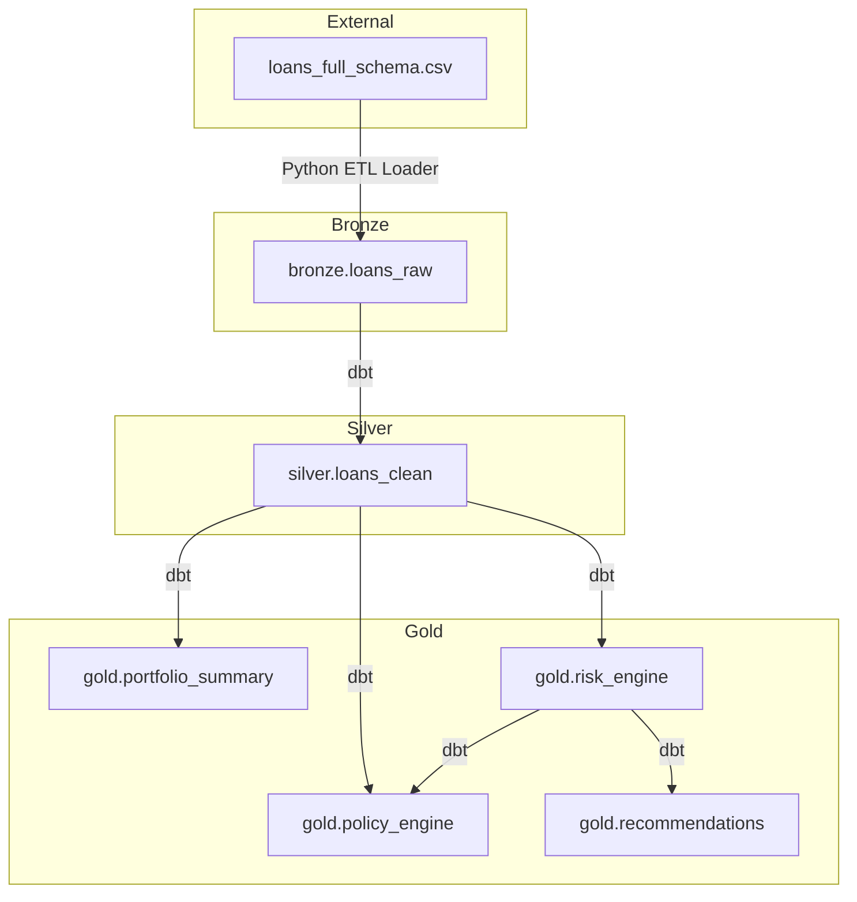
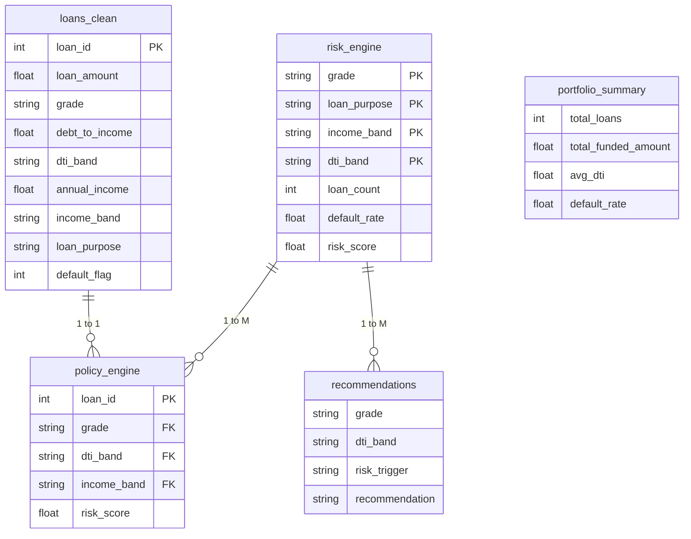

# Data Warehouse Architecture & ER Diagram

## Medallion Architecture

The data warehouse follows the Medallion architecture (Bronze -> Silver -> Gold).

```mermaid
graph TD
    subgraph External
        CSV[loans_full_schema.csv]
    end

    subgraph Bronze
        Raw[bronze.loans_raw]
    end

    subgraph Silver
        Clean[silver.loans_clean]
    end

    subgraph Gold
        Portfolio[gold.portfolio_summary]
        Risk[gold.risk_engine]
        Policy[gold.policy_engine]
        Recs[gold.recommendations]
    end

    CSV -- "Python ETL Loader" --> Raw
    Raw -- "dbt" --> Clean
    Clean -- "dbt" --> Portfolio
    Clean -- "dbt" --> Risk
    Clean -- "dbt" --> Policy
    Risk -- "dbt" --> Policy
    Risk -- "dbt" --> Recs
```

## Entity Relationship Diagram (ERD)

```mermaid
erDiagram
    loans_clean ||--o{ policy_engine : "1 to 1"
    risk_engine ||--o{ policy_engine : "1 to M"
    risk_engine ||--o{ recommendations : "1 to M"

    loans_clean {
        int loan_id PK
        float loan_amount
        string grade
        float debt_to_income
        string dti_band
        float annual_income
        string income_band
        string loan_purpose
        int default_flag
    }

    risk_engine {
        string grade PK
        string loan_purpose PK
        string income_band PK
        string dti_band PK
        int loan_count
        float default_rate
        float risk_score
    }

    policy_engine {
        int loan_id PK
        string grade FK
        string dti_band FK
        string income_band FK
        float risk_score
    }

    portfolio_summary {
        int total_loans
        float total_funded_amount
        float avg_dti
        float default_rate
    }
    
    recommendations {
        string grade
        string dti_band
        string risk_trigger
        string recommendation
    }
```
